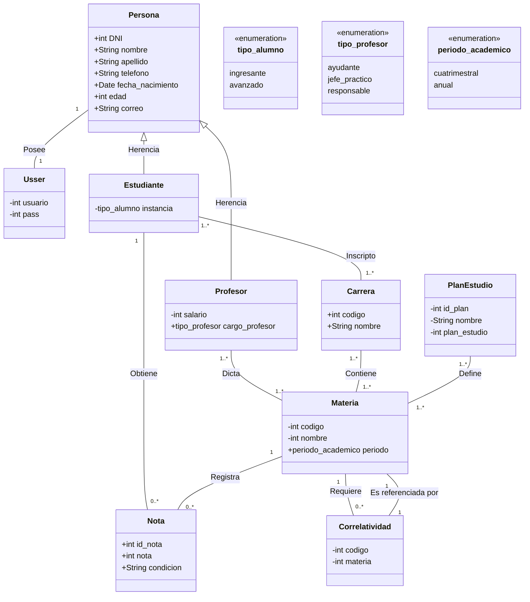

# Diseño y Arquitectura del Sistema

Este documento detalla la estructura técnica del Sistema de Gestión Universitaria, incluyendo su arquitectura fundamentada en capas y el diseño detallado de sus entidades.

## 1. Arquitectura del Sistema
El sistema sigue un patrón de **Arquitectura en Capas (Layered Architecture)** para asegurar la separación de responsabilidades y facilitar el mantenimiento.

*   **Capa de Presentación (Frontend):** Implementada con **HTML5, CSS3 y el motor de plantillas Mustache**. Se encarga de renderizar la interfaz de usuario de forma dinámica basada en los datos provistos por el backend.
*   **Capa de Lógica de Negocio (Backend):** Desarrollada en **Java**. Contiene los controladores y servicios que gestionan las reglas académicas (validación de correlativas, cálculos de promedio, inscripciones).
*   **Capa de Acceso a Datos (Persistencia):** Utiliza **SQLite** como motor de base de datos relacional, gestionando la persistencia de las entidades mediante una capa de DAO (Data Access Objects).

### Diagrama de Componentes e Interacciones

---

## 2. Diagrama de Diseño (Clases)
A continuación se presenta el modelo de dominio detallado, representando las entidades principales y sus relaciones dentro del sistema académico.

---

## 3. Responsabilidades e Interacciones
Cada componente del sistema tiene una responsabilidad clara para asegurar el flujo de datos:

1.  **Gestión de Inscripciones:** El componente de `Estudiante` interactúa con `Materia` y el servicio de `Correlatividad` en Java para verificar si el alumno cumple los requisitos previos antes de persistir la inscripción en `SQLite`.
2.  **Calificaciones:** Al finalizar un periodo, el `Profesor` registra una `Nota` vinculando un `Estudiante` con una `Materia`. Este evento actualiza el estado académico del alumno (Cursada/Aprobada).
3.  **Definición Académica:** El `Administrador` configura las `Carreras` y los `Planes de Estudio`, estableciendo la estructura sobre la cual operarán las inscripciones y cursadas.
